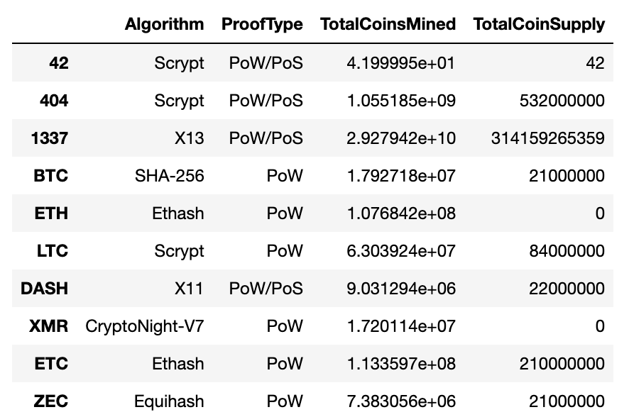
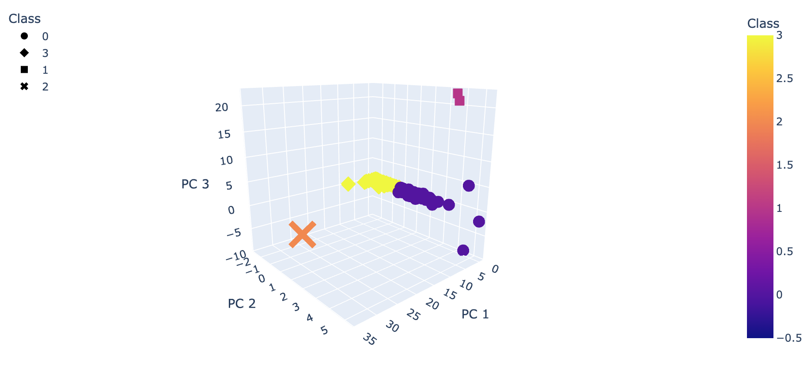
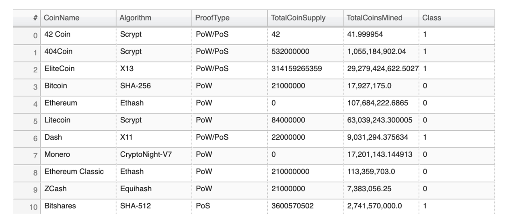

# Cryptocurrencies

## Overview

Using a provided dataset with data on cryptocurrencies, an analysis was run to group the cryptocurrencies. 

## Results

The cryptocurrency data was processed by removing null values and unneeded columns and rows. Two dataframes were created, one with the index and CoinName, the other with all other information. 

The data is now ready to for machine learning models. The Principal Component Analysis (PCA) algorithm was applied to the processed data and the dimensions were reduced to three principal components. The K-means algorithm was then used to create an elbow curve using hvPlot to find the best value for K from the DataFrame. Finally, the distinct groups are visualized with a 3D scatter plot and a table is created with all the tradable cryptocurrencies.  

